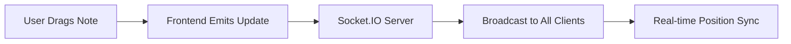

# 📝 Note AI Maker

<div align="center">


**A modern, AI-powered note-taking application with real-time collaboration and interactive canvas**

[🚀 Live Demo](#) • [📖 Documentation](#setup-instructions) • [🐛 Report Bug](#contributing) • [✨ Request Feature](#contributing)

</div>

---

## ✨ Features

<div align="center">

| 🎨 **Interactive Canvas** | 🤖 **AI-Powered** | ⚡ **Real-Time** | 🎯 **Modern UI** |
|:---:|:---:|:---:|:---:|
| Drag & drop notes with React Flow | Grammar improvement & summarization | Live position sync via Socket.IO | Built with HeroUI & Tailwind CSS |

</div>

### 🔥 Core Features

- **📄 Landing Page**: Responsive design with modern UI components (HeroUI, Shadcn, MagicUI)
- **🎨 Interactive Canvas**: Drag-and-drop note organization at `/canvas` using React Flow
- **📝 CRUD Operations**: Full Create, Read, Update, Delete functionality for notes
- **🤖 AI Enhancements**: 
  - ✅ Grammar improvement
  - 📊 Note summarization
  - 🔍 Content enhancement via OpenRouter API
- **⚡ Real-Time Updates**: Synchronized note positions across all connected clients
- **🔐 Simple Authorization**: Uses randomId for basic user identification

---

## 🛠️ Tech Stack

### Frontend
<div align="center">


</div>

- **React** - Core UI framework
- **Vite** - Fast build tool and dev server
- **React Flow** - Interactive node-based editor
- **HeroUI, Shadcn, MagicUI** - UI component libraries
- **Tailwind CSS** - Utility-first styling
- **Socket.IO Client** - Real-time communication

### Backend
<div align="center">


</div>

- **Express (v4.18.2)** - Web framework
- **MongoDB** - NoSQL database
- **Socket.IO** - Real-time bidirectional communication
- **OpenRouter API** - AI-powered enhancements

---

## 📁 Project Structure

<details>
<summary>📂 Frontend Structure</summary>

```
client/
├── 📁 src/
│   ├── 🧩 components/     # Reusable React components
│   ├── 📄 pages/          # Page components (Landing, Canvas)
│   ├── 🪝 hooks/          # Custom React hooks
│   ├── 🛠️ utils/          # Utility functions
│   └── 📝 types/          # TypeScript definitions
├── 📁 public/             # Static assets
├── ⚙️ .env                # Environment variables
├── ⚙️ vite.config.ts      # Vite configuration
├── ⚙️ tsconfig.json       # TypeScript config
└── 📦 package.json        # Dependencies
```

**Key Routes:**
- `/` - Landing page
- `/canvas` - Interactive note canvas

</details>

<details>
<summary>📂 Backend Structure</summary>

```
server/
├── 📁 src/
│   ├── ⚙️ config/         # Database connection
│   ├── 🎯 controllers/    # Request handlers
│   ├── 🛡️ middlewares/    # Authorization middleware
│   ├── 📊 models/         # MongoDB schemas
│   ├── 🛣️ routes/         # API route definitions
│   ├── 🔌 sockets/        # Socket.IO logic
│   └── 🛠️ utils/          # Utility functions
├── 📁 dist/               # Compiled output
├── 🚀 index.ts            # Server entry point
├── ⚙️ .env                # Environment variables
└── 📦 package.json        # Dependencies
```

</details>

---

## 🚀 Setup Instructions

### Prerequisites

<div align="center">


</div>

### 🖥️ Frontend Setup

1. **Clone and navigate to frontend**
   ```bash
   git clone <repository-url>
   cd client
   ```

2. **Install dependencies**
   ```bash
   npm install
   ```

3. **Configure environment variables**
   Create `.env` file in the `client` directory:
   ```env
   VITE_BACKEND_URL=http://localhost:3000/api
   VITE_BACKEND_URL_SOCKET=http://localhost:3000
   ```

4. **Start development server**
   ```bash
   npm run dev
   ```

5. **Access the application**
   Open [http://localhost:5173](http://localhost:5173) in your browser

### ⚙️ Backend Setup

1. **Navigate to backend directory**
   ```bash
   cd server
   ```

2. **Install dependencies**
   ```bash
   npm install
   ```

3. **Configure environment variables**
   Create `.env` file in the `server` directory:
   ```env
   OPENROUTER_API_KEY=your-api-key
   FRONTEND_URL=http://localhost:5173
   MONGOURI=your-mongodb-connection-string
   ```

4. **Start the server**
   ```bash
   npm start
   ```

5. **API ready**
   Backend available at [http://localhost:3000](http://localhost:3000)

---

## 🔧 Environment Variables

### Frontend Configuration

| Variable | Description | Example |
|----------|-------------|---------|
| `VITE_BACKEND_URL` | Backend API base URL | `http://localhost:3000/api` |
| `VITE_BACKEND_URL_SOCKET` | Socket.IO server URL | `http://localhost:3000` |

### Backend Configuration

| Variable | Description | Example |
|----------|-------------|---------|
| `OPENROUTER_API_KEY` | OpenRouter API key for AI features | `your-api-key` |
| `FRONTEND_URL` | Frontend URL for CORS configuration | `http://localhost:5173` |
| `MONGOURI` | MongoDB connection string | `mongodb://localhost:27017/notes` |

---

## 🛣️ API Routes

All routes are available under the `/api/notes` base path:

| Method | Endpoint | Description | Protected |
|--------|----------|-------------|-----------|
| `GET` | `/api/notes/` | Retrieve all notes | ✅ |
| `POST` | `/api/notes/` | Create a new note | ✅ |
| `GET` | `/api/notes/:id` | Get note by ID | ✅ |
| `PUT` | `/api/notes/:id` | Update note by ID | ✅ |
| `DELETE` | `/api/notes/:id` | Delete note by ID | ✅ |
| `POST` | `/api/notes/:id/enhance` | AI enhance note | ✅ |
| `GET` | `/api/notes/details` | API information | ❌ |

### Example API Response

<details>
<summary>GET /api/notes/details</summary>

```json
{
  "message": "NOTE API is running!",
  "version": "1.0.5",
  "endpoints": {
    "notes": {
      "GET /api/notes": "get notes from server",
      "POST /api/notes": "create a notes to server",
      "PUT /api/notes/:id": "update a note from server",
      "DELETE /api/notes/:id": "delete a notes from server",
      "POST /api/notes/:id/enhance": "enhance a note from server",
      "GET /api/notes/:id": "get a note by id from server"
    }
  }
}
```

</details>

---

## ⚡ Real-Time Functionality

<div align="center">



</div>

- **Socket.IO Integration**: Enables real-time note position synchronization
- **Live Updates**: Changes are instantly reflected across all connected clients
- **Implementation**: Backend logic in `server/src/sockets/`, frontend uses Socket.IO client

---

## 🚀 Deployment

### Frontend (Vercel)

1. **Push to GitHub**
   ```bash
   git add .
   git commit -m "Deploy frontend"
   git push origin main
   ```

2. **Deploy on Vercel**
   - Import repository to Vercel
   - Set environment variables:
     ```
     VITE_BACKEND_URL=https://your-backend.onrender.com/api
     VITE_BACKEND_URL_SOCKET=https://your-backend.onrender.com
     ```
   - Deploy automatically

### Backend (Render)

1. **Create Render Service**
   - Link your GitHub repository
   - Set environment variables:
     ```
     OPENROUTER_API_KEY=your-openrouter-key
     FRONTEND_URL=https://your-app.vercel.app
     MONGOURI=your-production-mongodb-uri
     ```

2. **Deploy**
   - Render will automatically build and deploy your backend

> **⚠️ Important**: Update environment variables to use production URLs, not localhost

---

## 🤝 Contributing

We welcome contributions! Here's how to get started:

### 🛠️ Development Workflow

1. **Fork the repository**
   ```bash
   git fork https://github.com/your-username/note-ai-maker
   ```

2. **Create a feature branch**
   ```bash
   git checkout -b feature/amazing-feature
   ```

3. **Make your changes**
   - Write clean, documented code
   - Follow existing code style
   - Add tests if applicable

4. **Commit your changes**
   ```bash
   git commit -m "✨ Add amazing feature"
   ```

5. **Push and create PR**
   ```bash
   git push origin feature/amazing-feature
   ```

### 📋 Contribution Guidelines

- 🐛 **Bug Reports**: Use the issue template
- ✨ **Feature Requests**: Describe the use case
- 💻 **Code Style**: Follow existing patterns
- ✅ **Testing**: Add tests for new features
- 📝 **Documentation**: Update README if needed

---

## 📄 License

<div align="center">

This project is licensed under the **MIT License**.

See the [LICENSE](LICENSE) file for details.

---

**Made with ❤️ by Donex FIence**

⭐ **Star this repo if you found it helpful!**

</div>